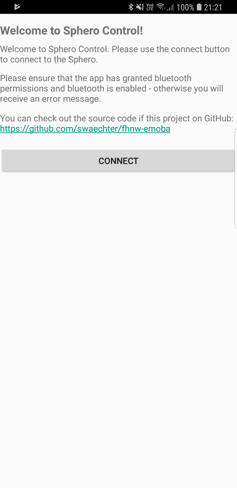
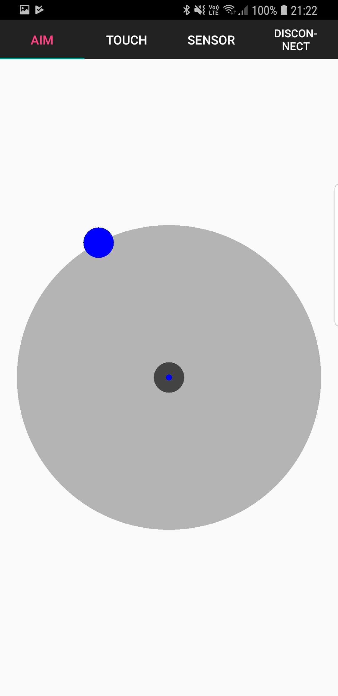
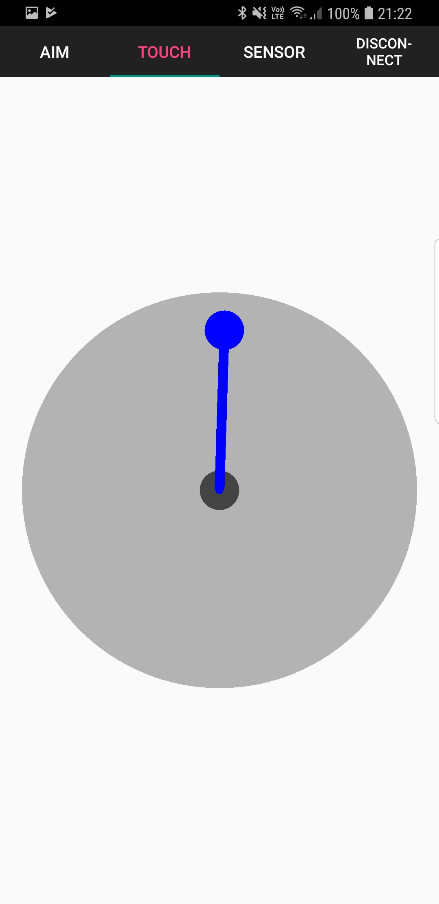
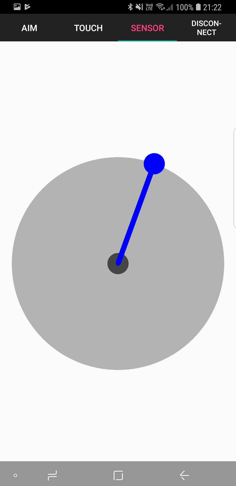
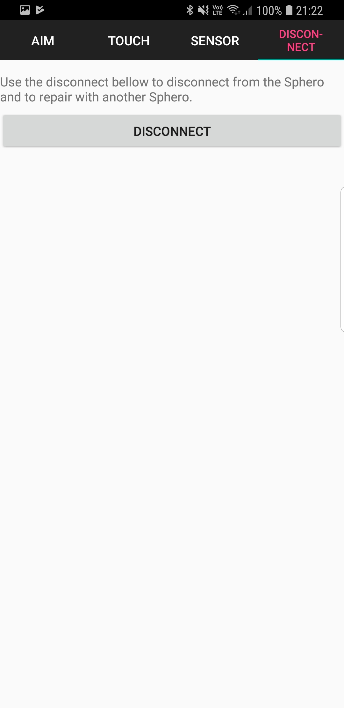

# Android Sphero Control (Module emoba FHNW)

## Introduction

This project provides our Android application for the Sphero SPRK+ made during the emoba module at the FHNW.

## Screenshots

### Connect to Device

### Calibrate Sensors

### Touch Control

### Sensor Control

### Disconnect from Device

## Known Erratas

* The disconnect functionality does not work in the emulator because the Sphero mock doesn't call the listener after a disconnect.

## Team

* Simon Wächter <waechter.simon@gmail.com>
* Magdalena Marinkova <magdalena.marinkov@gmail.com>
